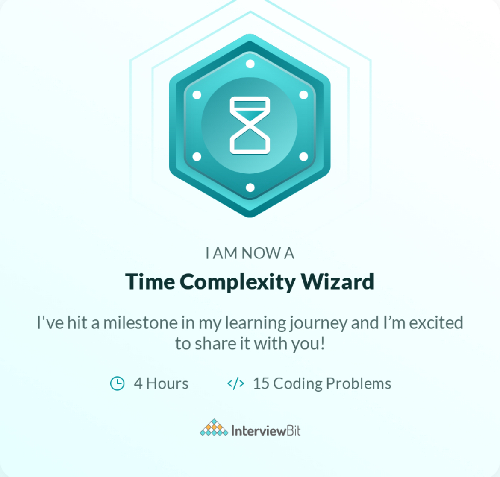

### Hi there, I'm Gaganjot Singh 👋
A software developer passionate about bringing ideas to life through coding.
 

* 💬 Curious about something? Feel free to ask me [here](https://github.com/megaganjotsingh/megaganjotsingh/issues)

* ✨ Deeply passionate about crafting intuitive UI / UX experiences.

* 📖 Open-Source Contributor

* 💻 Making a difference, One line of code at a time

* ♥️ Exploring new places

* 💁🏻I share my Insights, Tricks, and Tips on iOS development on my LinkedIn.

### My iOS Certificates 🎖

 Hacking with Swift Certificate | SwiftUI Udemy Certificate
:-------------------------:|:-------------------------:|
 |  

Diving Deep into Swift Certificate | Time Complexity Wizard Certificate
:-------------------------:|:-------------------------:|
 | 
